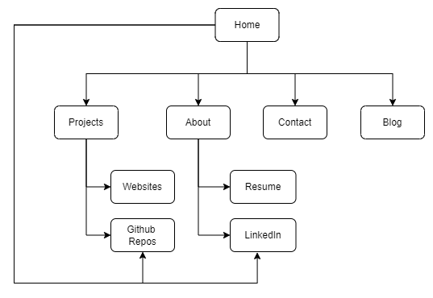
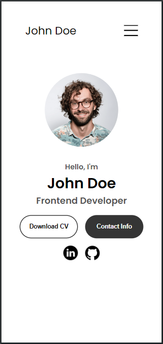
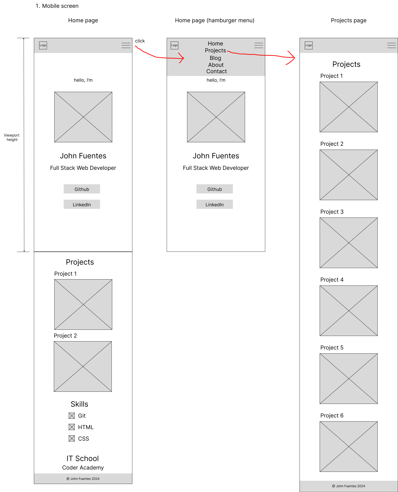
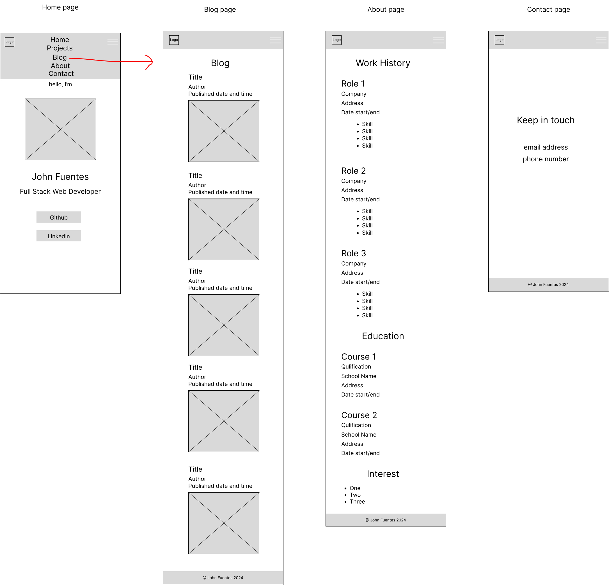

# Portfolio Website

## Term 1, Assessment 2

Coder Academy, Web Development Accelerated

### 1. Site Map

The site map shows how my website will be navigated.

<!--  -->

The home page will show brief description about myself and buttons to link my Github and LinkedIn profiles. Other sections will be the samples of my coding projects, skills, school and contact details. It has a navigation menu for other pages.

The Projects page contains my portfolio. Here I can use the challenges from Ed Lessons. There will be buttons to link on each project's website and github repository.

The About page contains work history, education and interests. There will be buttons to link my LinkedIn profile and resume.

The Contact page contains email address and phone number.

This blog page contains list of posts related to web development and my journey as a web developer.

### 2. Wireframes

### 2.1 Mobile screen

As I was searching online, I found a sample portfolio website *([link to sample portfolio website](https://tangerine-hummingbird-1479b6.netlify.app/#projects))* that had caught my attention. I like its hero section because of its simplicity, nice typography and good use of white spaces.

For my website, I want the greetings "Hello, I'm" goes first before the profile photo and name. Also, I want to put only the call to action buttons for Github and LinkedIn.

### 2.1.1 Home Page

When a user visits my website, they will see right away who I am (Name and Photo) and what I do (Full Stack Web Developer). Below it are buttons for my Github and LinkedIn profiles should they want to check my activities.

Since the viewport width of mobile screen is small, the navigation menu is hidden and replaced with hamburger icon. The navigation menu will appear once the icon is clicked.

If you scroll down the home page, there will be the projects section. The image is a screenshot of the website. The next sections my skills, school and the footer. In the skills section, an icon is placed beside each skill.

There are two ways to return to home page, it is done by clicking the logo or the "home" in navigation menu.

### 2.1.2 Projects Page

There will be six projects in my portfolio to showcase my work. Each project will have a title and an image.

### 2.1.3 Blog Page

Five blog posts will be shown with title, author, published date and time, and an image.

### 2.1.4 About Page

In this page will be my work history. The skills will be presented using unordered list. Next are the education and interest sections.

### 2.1.5 Contact Page

The contact page is simple, it only shows my email address and phone number which are located at the center of screen.