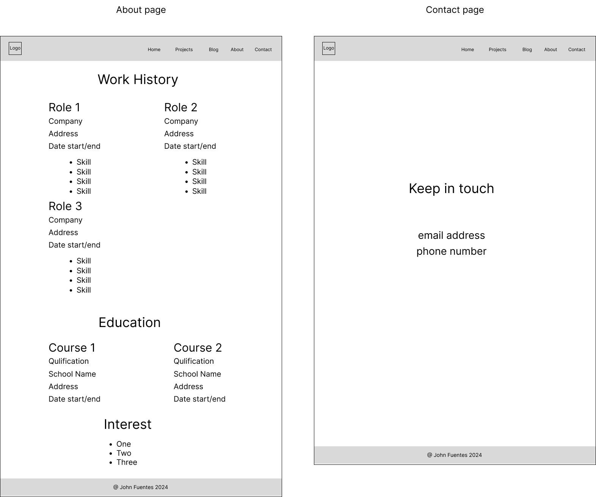
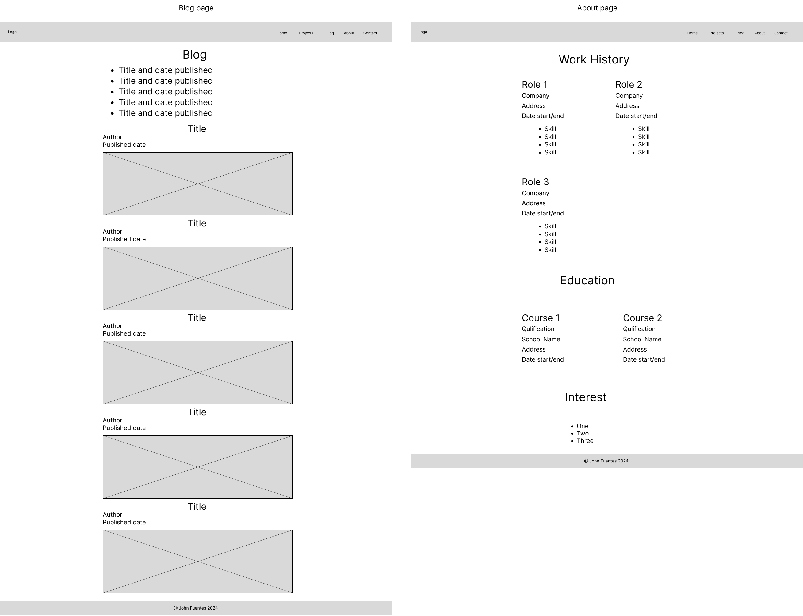

# Portfolio Website

## Term 1, Assessment 2

Coder Academy, Web Development Accelerated

## 1. Site Map

The site map shows how my website will be navigated.

<!--  -->

The home page will show brief description about myself and buttons to link my Github and LinkedIn profiles. Other sections will be my projects, skills, school and contact info. It has a navigation menu to link the other pages.

The Projects page contains my portfolio. There will be buttons to link on each project's website and github repository.

The About page contains work history, education and interests. There will be buttons to link my resume and LinkedIn profile.

The Contact page contains email address and phone number.

This blog page contains list of posts related to web development and my journey as a web developer.

## 2. Wireframes

### 2.1 Mobile screen

As I was searching online, I found a sample portfolio website *([link to sample portfolio website](https://tangerine-hummingbird-1479b6.netlify.app/#projects))* that caught my attention. I like its hero section because of its simplicity, nice typography and good use of white spaces.

For my website, I want the greetings "Hello, I'm" to be on top of profile photo. Also, I only want the call to action buttons for Github and LinkedIn to be in hero section. The header plus the hero sections will take up the whole viewport height.

### 2.1.1 Home Page

When a user visits my website, they will see right away who I am (name and photo) and what I do (Full Stack Web Developer). Below it are buttons for my Github and LinkedIn profiles should they want to check my activities.

The navigation menu is initially hidden and replaced with hamburger icon. It will appear once the icon is clicked. The order of menu items is different from the site map. I decided to change the order in wireframe to have a better flow in navigating the website.

If you scroll down, there is the projects section with a screenshot of the websites. The next sections are skills, school and the footer. In skills section, an icon is placed beside each skill.

There are two ways to return to home page, click the logo or "home" in navigation menu.

### 2.1.2 Projects Page

There will be six projects in my portfolio to showcase my work.

### 2.1.3 Blog Page

Five blog posts will be shown with title, author, published date and an image.

### 2.1.4 About Page

This page will show my work history and the skills are listed using bullet points. Next are the education and interest sections.

### 2.1.5 Contact Page

The contact page is simple, it only shows my email address and phone number which are located at the center of screen.

### 2.2 Tablet screen

Generally in tablet screen, I want to increase the font sizes and images. I also want the 'projects' and 'about' pages to have two columns.

In hero section of home page, I want the Github and LinkedIn buttons to line up in one row. In mobile screen, these buttons were arranged vertically.

### 2.3 Desktop screen

Since the screen is large now, I want the hero section to have two columns. The profile photo will be at left side while all texts will be at the right. This means that the order of greetings "Hello, I'm" will be changed.

For all pages, I will set a maximum limit for the width so that the contents will not stretch to the whole viewport width which is not good to the eye.

## 3. Website Screenshots

