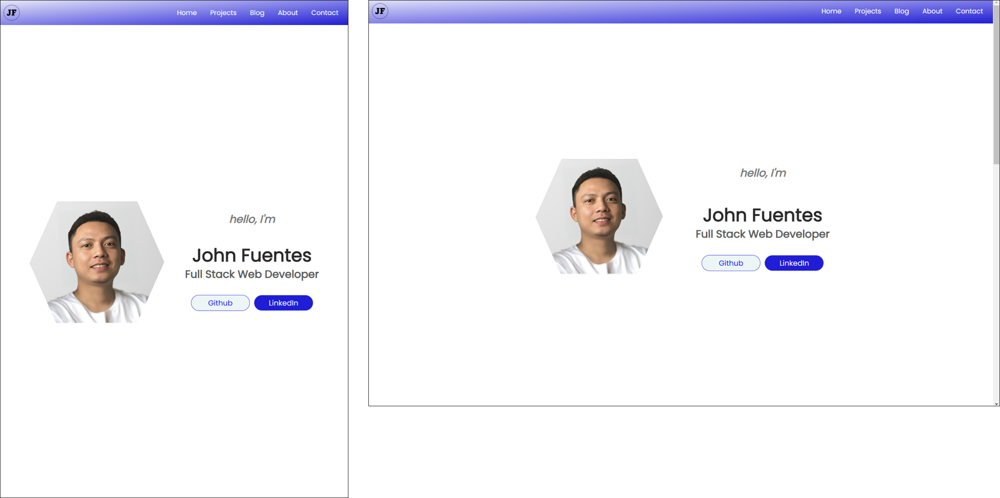

# Portfolio Website

## Term 1, Assessment 2

Web Development Accelerated  
Coder Academy

## Table of Contents

1. [Portfolio Website](#portfolio-website)
2. [Github Repository](#github-repository)
3. [Purpose](#purpose)
4. [Target Audience](#target-audience)
5. [Tech Stack](#tech-stack)
6. [Functionality and Features](#functionality-and-features)
7. [Site Map](#site-map)
8. [Wireframes](#wireframes)  
    a. [Mobile screen](#mobile-screen-wireframe)  
    b. [Tablet screen](#tablet-screen-wireframe)  
    c. [Desktop screen](#desktop-screen-wireframe)
9. [Website Screenshots](#website-screenshots)

## Portfolio Website

https://portfolio-johnfuentes.netlify.app/

## Github Repository

https://github.com/jmcaluyafuentes/portfolio-T1A2

## Purpose

The purpose of this portfolio website is to apply the knowledge and exercises I learned from our class, build skills in coding using HTML and CSS, debug errors, learn from mistakes and improve. This project involves planning the site map, designing the layout in wireframe; applying semantic, readable and responsive design in codes; version control using Git, writing markdown document and more.

## Target Audience

The target audiences of this portfolio website are employers who are looking for junior web developers.

## Tech Stack

This project utilizes HTML and CSS languages, and it is deployed in Netlify. All documents (ie., markdown, HTML, CSS), images and pdf file (i.e. resume) are stored in Github.

## Functionality and Features

* All pages has a header that contains the navigation menu. For mobile screen, the navigation menu is initially hidden and can be displayed by clicking the hamburger icon.
* The website is fully responsive to cater different screen viewport widths (i.e., mobile, tablet and desktop). It is also responsive for landscape orientation.
* A logo is placed in the header as a signature of my work. The logo is also linked to the home page.
* In home page, the hero section introduces my complete name and role as full stack web developer.
* There are call to action buttons such Github, LinkedIn and resume so that the detailed information are always ready anytime the employers want to see them.
* At the bottom of home page and in 'contact' page, if you click the email address, the email application will open automatically for employers' convenience should they want to reach me out.
* In mobile screen, once you click my phone number it will directly dial the number for employers' convenience.
* Two representatives of my projects are showcased in home page and the rest are in 'projects' page together with clickable buttons that links to project's website and github repo.
* My set of skills with their corresponding logos are shown in home page.
* My work history, education and interests are shown in 'about' page. A button is available for them to see a pdf file of my resume and another button for my linkedIn profile.
* The 'blog' page contains five blog posts with title and published date. Semantic tags are used for the author, published date and image.
* All pages have footer section that shows the copyright information.

## Site Map

The site map shows how my website will be navigated.

<!--  -->

The home page will show brief description about myself and buttons to link my Github and LinkedIn profiles. Other sections will be my projects, skills, school and contact info. It has a navigation menu to link the other pages.

The Projects page contains my portfolio. There will be buttons to link on each project's website and github repository.

The About page contains work history, education and interests. There will be buttons to link my resume and LinkedIn profile.

The Contact page contains email address and phone number.

This blog page contains list of posts related to web development and my journey as a web developer.

## Wireframes

### Mobile screen wireframe

As I was searching online, I found a sample portfolio website *([link to sample portfolio website](https://tangerine-hummingbird-1479b6.netlify.app/#projects))* that caught my attention. I like its hero section because of its simplicity, nice typography and good use of white spaces.

For my website, I want the greetings "Hello, I'm" to be on top of profile photo. Also, I only want the call to action buttons for Github and LinkedIn to be in hero section. The header plus the hero sections will take up the whole viewport height.

#### Home Page

When a user visits my website, they will see right away who I am (name and photo) and what I do (Full Stack Web Developer). Below it are buttons for my Github and LinkedIn profiles should they want to check my activities.

The navigation menu is initially hidden and replaced with hamburger icon. It will appear once the icon is clicked. The order of menu items is different from the site map. I decided to change the order in wireframe to have a better flow in navigating the website.

If you scroll down, there is the projects section with a screenshot of the websites. The next sections are skills, school and the footer. In skills section, an icon is placed beside each skill.

There are two ways to return to home page, click the logo or "home" in navigation menu.

#### Projects Page

There will be six projects in my portfolio to showcase my work.

#### Blog Page

Five blog posts will be shown with title, author, published date and an image.

#### About Page

This page will show my work history and the skills are listed using bullet points. Next are the education and interest sections.

#### Contact Page

The contact page is simple, it only shows my email address and phone number which are located at the center of screen.

### Tablet screen wireframe

Generally in tablet screen, I want to increase the font sizes and images. I also want the 'projects' and 'about' pages to have two columns.

### Desktop screen wireframe

Since the screen is large now, I want the hero section to have two columns. The profile photo will be at the left side while all texts will be at the right. This means that the order of greetings "Hello, I'm" will be changed.

For all pages, I will set a maximum limit for the width so that the contents will not stretch to the whole viewport width which is not good to the eye.

## Website Screenshots

### Home Page

#### Header Section, Logo, Navigation Menu and Hero Section

The first image above shows the appearance of home page when the users (employers) visits my website.

I placed the greetings "Hello, I'm" on top of the profile photo to signify my courtesy and respect to the users. They will see right away a brief information about myself (i.e., complete name and my role as full stack web developer). These contents are centered on the hero section with good amount of white space to draw their attention to the main thing.

Hexagon is used to enclose my profile photo because I want it to be unique. The usual profile photo is enclosed in circle.

My name has the largest font size followed by my role to give emphasis on me as an aspiring web developer. I tried different font family from Google Fonts and Poppins is so far the nicest font appropriate in my website.

Next are the call to action buttons for my Github and LinkedIn profiles. I chose color blue for it is captivating to the eye. When the users see it, they might be interested to click the buttons and discover my activities in Github and LinkedIn.

Blue is also the color in header section. The navigation is initially hidden and only the hamburger icon is shown. Once you click the icon, the menu will appear as shown in the second image above. You can click the 'x' icon to hide the menu.

The logo is black to match the color of my name in hero section. The logo and the 'home' item in navigation menu are linked to home page.

Both tablet and desktop screens display the navigation menu and the hamburger icon is hidden. Media queries are used to implement responsiveness. The hero section has two columns now. On the left is the profile photo while all texts are on the right. The order has also changed since the greetings "hello, I'm" is now placed after the profile photo.

#### Other sections (projects, education, contact and footer)

The other sections in home page are shown above.

The projects section has background of gradient colors and each project is enclosed in a box with rounded corners to give emphasis. Two representative projects are showcased with a short description about the project. Each project has links to its website and Github repository; so I retained the hyperlink decoration on the texts. The screenshot image also links to the project's website. There is also a link at the bottom that will redirect to the 'projects page' if the user wanted to see my other projects.

Other sections are the skills, education and contact information. The background colors are in alternate to make it good to the eye when reading each section. I decided to add all tech stack (not just HTML and CSS as the current topics) that I will learn throughout the bootcamp. Icon images are added so that users can easily identify the items.

A semantic address tag is used in the email address. If clicked, it will automatically open the email application for user's convenience. If the phone number is clicked (in mobile screen), it will automatically dial the number.

In mobile screen, the contents in each section are arranged vertically to maximize the viewport width. In tablet and desktop screens, the projects are arranged in two columns to have a nice presentation. I set a maximum width for desktop screen so that the contents will not stretch to the whole screen which is not a good user experience.

Lastly, the footer section has black background and white texts to contrast the whole page.

### Projects Page

Six projects are shown in the 'projects' page. I used the Ed challenges on this

At the early stage of making the project, I used Flexbox to layout the home page. Later on, our educator Matt gave us the opportunity to learn CSS Grid during the master class. So after that, I used grid for the rest of pages (i.e., projects, blog, about). It is easier to layout the whole page with grid and just use flexbox on grid items when necessary.

### Blog Page

Unlike the projects page, there is only one column in blog page as it is appropriate for reading purposes. On top of the page are the list of five blog titles and their published dates. For easy navigation, each title is linked to its blog post on the same page. Semantic time tags are used for the published date.

In each blog post, semantic tags are used in author, date and image using address, time and figure tags, respectively. Under each post has a link called "back to top" which is useful if the user wants to check again the list of titles at the beginning of the page.

### About Page

In mobile screen, all contents are arranged in column. Two columns for tablet and desktop. Furthermore, in work history and education sections, the h1 headings are placed on the left side while all information are on the right. I used grid to layout the responsiveness of this page. For the desktop screen, I set a maximum width so that the contents will not stretch to the whole page. In the interest section, I decided to add images and remove the bullet points in contrast to the wireframe.

The contact page is simple, contents are displayed at the center of page. A semantic address tag is used in the email address. If clicked, it will automatically open the email application for user's convenience. If the phone number is clicked (in mobile screen), it will automatically dial the number.

### Landscape Orientation for mobile screen

I added  media query for landscape orientation of mobile screen in case they are using their phones in landscape mode at the time they viewed my website.

